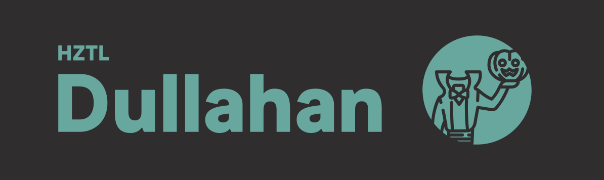

# Dullahan

Because it's headless.

## Testing locally before we make a real package

```
npm link
```

This will "install" the cli globally but use the local files. Works great for development.

## TODOS:

- Ensure dependencies across packages are unified
